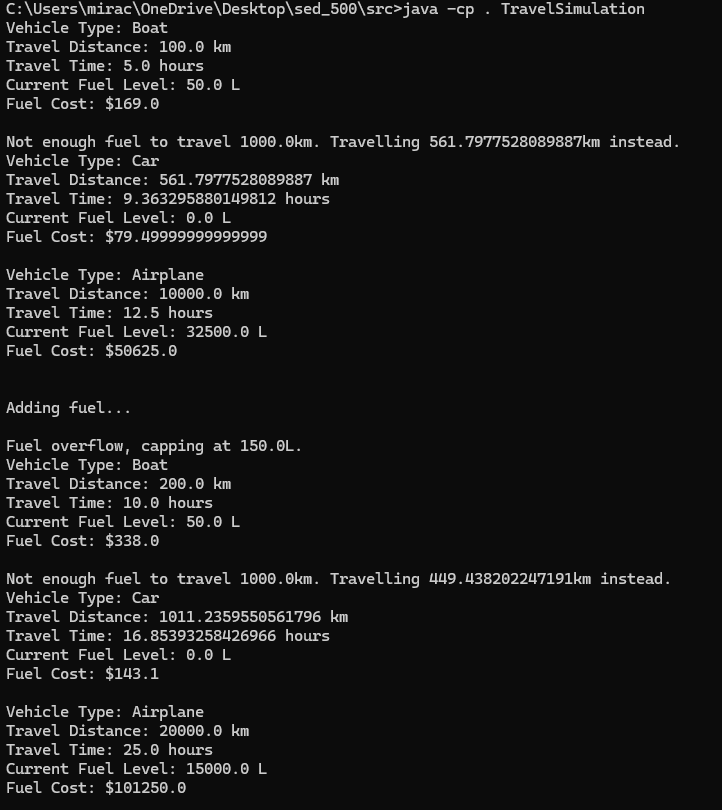

# Travel Simulator Project

## Preview

## UML Diagram


## What type of a design pattern (creational, structural, behavioural, custom) did you employ in this assignment? Why?
**Type**: Structural  
**Pattern**: Adapter Pattern  
**Reason**: The Adapter pattern was used to standardize the interfaces of different vehicle classes (Boat, Car, Airplane) using the `IVehicle` interface. This lets the `TravelSimulation` class interact with all vehicles consistently without changing the original code.

## Describe a software design pattern that you have used before this course, even if you were not aware of it.
**Pattern Used Before**: Singleton  
**Description**: We used the Singleton pattern in a previous project to ensure only one instance of a configuration class was created, allowing for consistent access to configuration settings.

## Do you feel standard design patterns are of great assistance, or great hindrance, in software design? Give advantages and disadvantages.
**Advantages**:
1. Provide proven solutions to common problems.
2. Improve code readability and maintenance.
3. Facilitate communication between developers.

**Disadvantages**:
1. Can lead to overengineering if misused.
2. Not always a perfect fit for specific problems.
3. Increase complexity if applied without necessity.

## What are some major drawbacks of the Singleton design pattern?
1. **Limits Scalability**: Makes testing difficult as it limits instance creation.
2. **Violates Single Responsibility Principle**: Often leads to coupling multiple responsibilities in one class.
3. **Hidden Dependencies**: Creates hidden dependencies between classes, leading to tight coupling and reduced flexibility.

## How to Run the Project
### Prerequisites
- Java Development Kit (JDK) installed (preferably JDK 8 or higher).
- IDE or command line setup for Java development.

### Steps to Compile and Run
1. **Compile the Project:**
   ```bash
   cd C:\path\to\project\src
   javac -d . *.java legacy/*.java

### Project Structure
TravelSimulatorProject/
├── src/
│   ├── TravelSimulation.java
│   ├── IVehicle.java
│   ├── VehicleUtility.java
│   ├── BoatAdapter.java
│   ├── CarAdapter.java
│   ├── AirplaneAdapter.java
│   ├── legacy/
│   │   ├── Boat.java
│   │   ├── Car.java
│   │   └── Airplane.java
├── images/
│   ├── preview.png
│   └── uml.png
├── README.md
